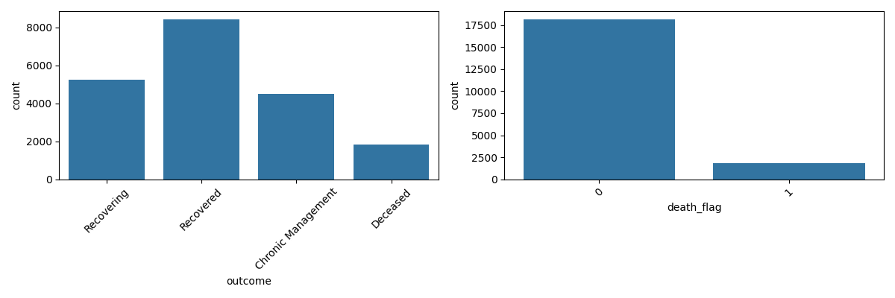
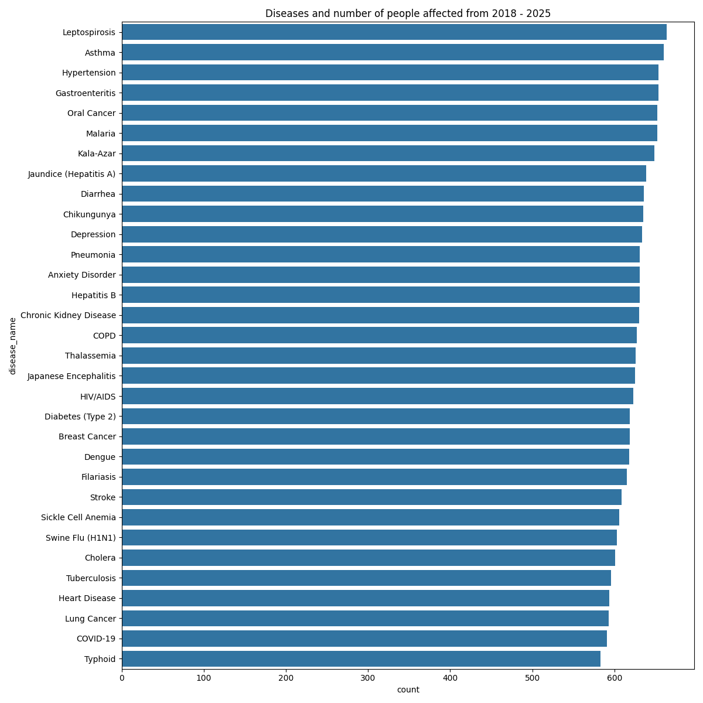
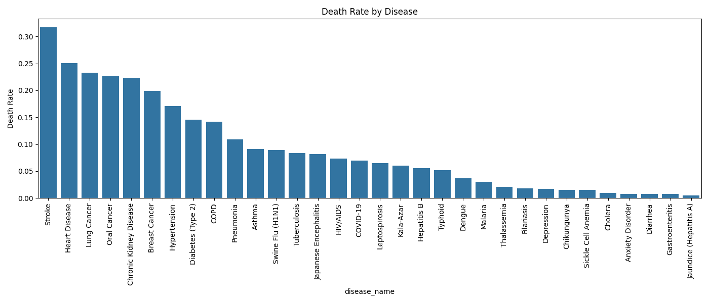
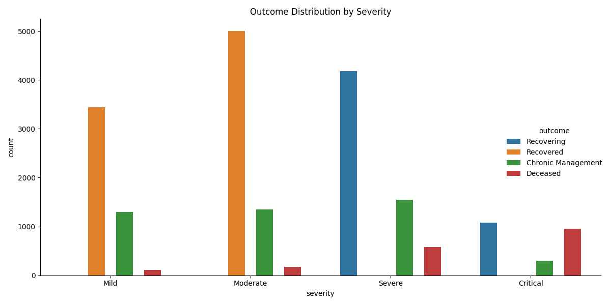
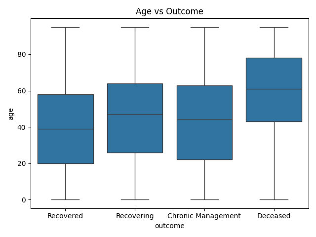
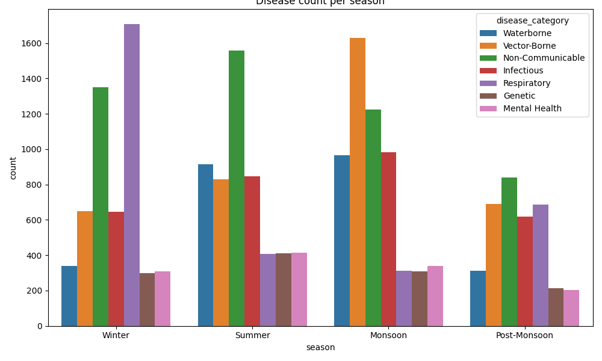
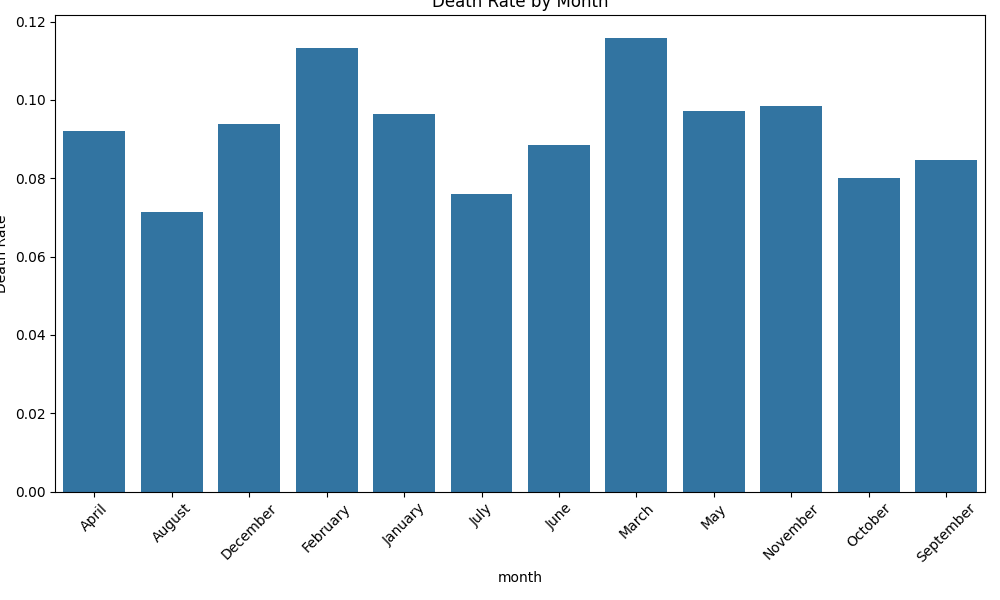
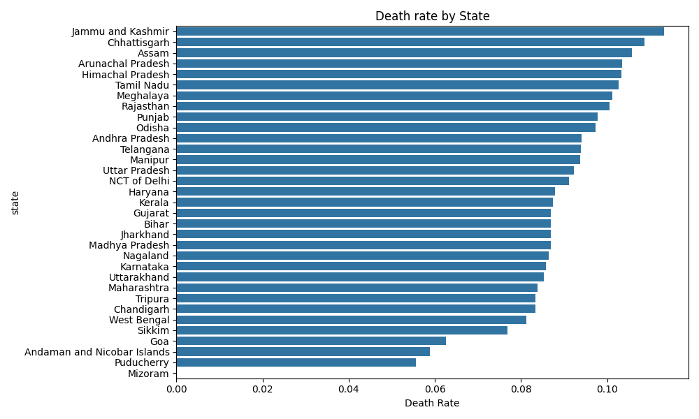
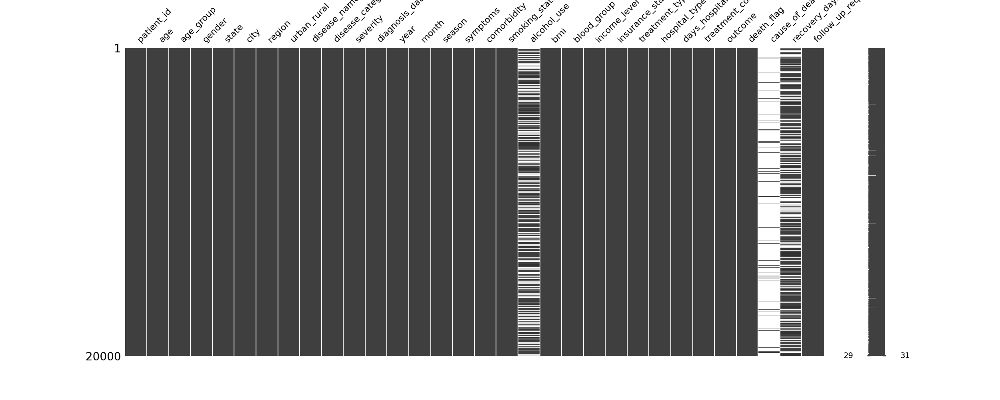
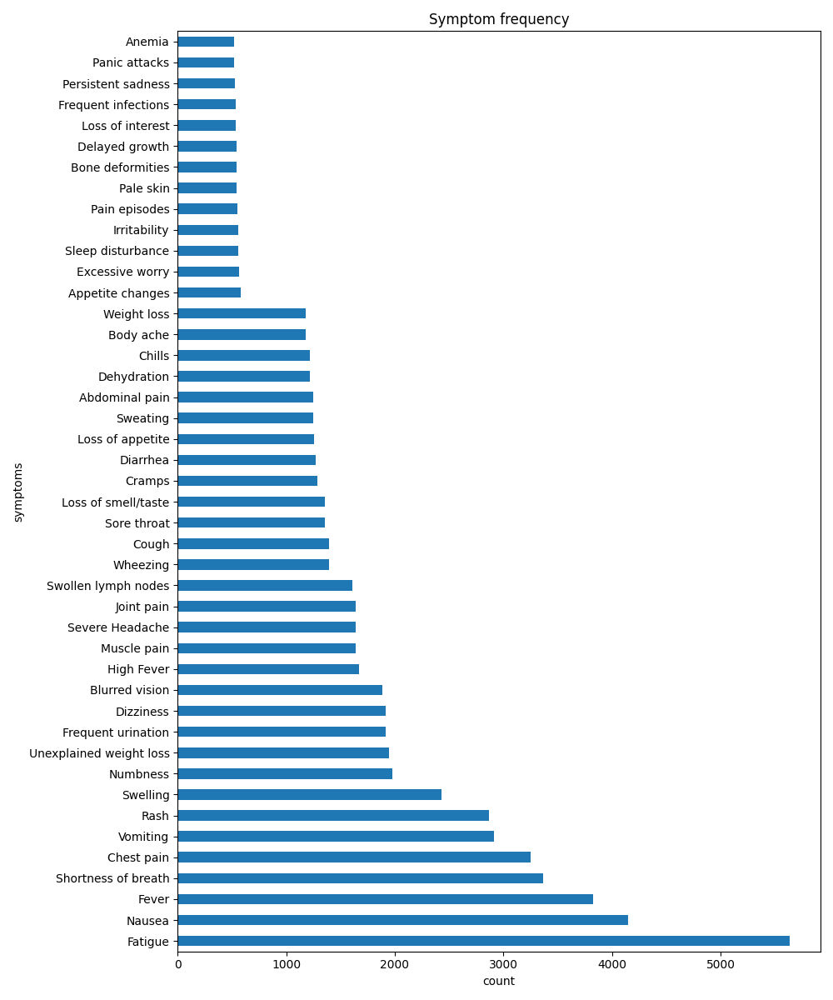

# Indian Healthcare Dataset — EDA & Preprocessing

Exploratory data analysis and preprocessing pipeline on an Indian patient dataset covering 20,000 records across 32 diseases (2018–2025). The goal was to understand the data deeply and prepare a clean, ML-ready dataset for future XGBoost classification.

---

## Dataset

- **Source:** [Indian Patient Disease and Treatment Dataset](https://www.kaggle.com/datasets/ashyou09/indian-patient-disease-and-treatment-dataset) by ashyou09, licensed under MIT
- **Size:** 20,000 patients, 32 original columns
- **Diseases:** 32 across vector-borne, respiratory, cardiovascular, metabolic, and other categories
- **Period:** 2018–2025

The raw dataset is not stored in this repository. It is downloaded automatically via `kagglehub` when you run the notebook.

---

## Repository Structure

```
├── app.ipynb        # EDA + preprocessing notebook
├── figures/         # All plots generated during EDA
├── README.md
└── .gitignore
```

---

## EDA Findings

### Target Distribution

| Outcome | Count | % |
|---|---|---|
| Recovered | 8,440 | 42.2% |
| Recovering | 5,253 | 26.3% |
| Chronic Management | 4,485 | 22.4% |
| Deceased | 1,822 | 9.1% |

Overall death rate: **9.11%** — the dataset is imbalanced, which needs to be handled during model training.



---

### Disease Burden



| Deadliest (Death Rate) | | Lowest Mortality | |
|---|---|---|---|
| Stroke | 31.69% | Jaundice / Hepatitis A | 0.47% |
| Heart Disease | 25.08% | Gastroenteritis | 0.76% |
| Lung Cancer | 23.27% | Diarrhea | 0.79% |
| Oral Cancer | 22.70% | Anxiety Disorder | 1.09% |
| Chronic Kidney Disease | 22.38% | Asthma | 1.22% |



---

### Severity vs Outcome

Severity is the strongest single predictor of death (correlation: 0.33). Critical patients die at 17 times the rate of Mild patients.

| Severity | Death Rate |
|---|---|
| Mild | 2.37% |
| Moderate | 2.59% |
| Severe | 9.25% |
| Critical | 41.00% |



---

### Age vs Outcome

Deceased patients are on average 18.6 years older than recovered patients.

| Outcome | Mean Age |
|---|---|
| Deceased | 58.7 years |
| Recovering | 45.5 years |
| Chronic Management | 44.0 years |
| Recovered | 40.1 years |



---

### Seasonal and Monthly Patterns

Vector-borne diseases peak heavily in Monsoon (1,629 cases vs 648 in Winter). Winter carries the highest death rate (10.08%) driven by cardiac and respiratory conditions. March and February are the deadliest months at 11.59% and 11.32% respectively.





---

### Geographic Patterns



---

### Missing Data



---

### Symptom Frequency



---

## Preprocessing

### Missing Values

| Column | Missing | Strategy |
|---|---|---|
| `cause_of_death` | 18,178 (91%) | Dropped — no new information beyond `disease_name` |
| `alcohol_use` | 6,627 (33%) | Left as NaN — XGBoost handles natively |
| `recovery_days` | 6,307 | Deceased → `max * 2` sentinel; Chronic Management → NaN |
| `comorbidity` | varies | Filled with `"No comorbidity"` |

### Encoding

| Column | Method | Reason |
|---|---|---|
| `severity` | OrdinalEncoder: Mild→0, Moderate→1, Severe→2, Critical→3 | Real medical order |
| `income_level` | OrdinalEncoder: BPL→0 … High→4 | Real socioeconomic order |
| `smoking_status` | OrdinalEncoder: Never→0, Former→1, Current→2 | Real risk order |
| `alcohol_use` | map(): Occasional→1, Regular→2, Heavy→3 | Preserves NaN, correct order |
| `season` | map(): Summer→1, Monsoon→2, Post-Monsoon→3, Winter→4 | Seasonal progression |
| `symptoms` | MultiLabelBinarizer → 44 binary columns | Fixed vocabulary of 44 symptoms |
| All others | LabelEncoder | Nominal categories with no meaningful order |

### Columns Dropped

| Column | Reason |
|---|---|
| `patient_id` | Unique identifier — no predictive value |
| `age_group` | Redundant — `age` column already present |
| `city` | Redundant — covered by `state` and `region` |
| `diagnosis_date` | Raw date string — `year`, `month`, `season` already extracted |
| `cause_of_death` | 91% missing, no information beyond `disease_name` |
| `treatment_type` | Post-admission leakage |
| `recovery_days` | Post-outcome leakage |
| `days_hospitalized` | Post-outcome leakage |
| `follow_up_required` | Post-outcome leakage |
| `treatment_cost_inr` | Post-admission leakage |

---

## Output

```
X.csv  →  20,000 rows × 63 columns  (admission-time features only)
y.csv  →  20,000 rows × 2 columns   (death_flag, outcome)
```

`alcohol_use` retains NaN intentionally — XGBoost learns the optimal direction for missing values during training via its default direction mechanism.

---

## Future Work

- [ ] Train XGBoost on `death_flag` (binary classification)
- [ ] Train XGBoost on `outcome` (4-class classification)
- [ ] Handle class imbalance using `scale_pos_weight`
- [ ] Feature importance analysis
- [ ] Hyperparameter tuning
- [ ] Train/test split and cross-validation

---

## Requirements

```
pandas, numpy, scikit-learn, matplotlib, seaborn, missingno, kagglehub, jupyter
```

```bash
pip install pandas numpy scikit-learn matplotlib seaborn missingno kagglehub jupyter
```

## How to Run

1. Clone the repository
2. Place your Kaggle API credentials (`kaggle.json`) in `~/.kaggle/`
3. Open `app.ipynb` and run all cells top to bottom
4. `X.csv` and `y.csv` will be generated automatically
